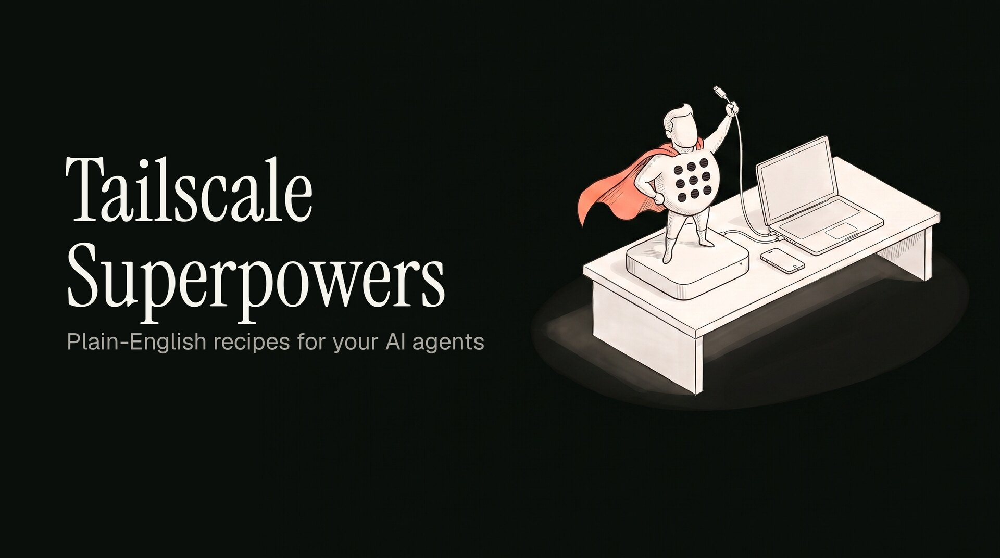

<p align="center">
  
</p>

# Tailscale Superpowers

Pro Tailscale workflows for every device you own.

A skill for the AI agents on your Macs. Your agent gets the exact commands for everyday jobs, like safe hotel wifi, printing at home from anywhere, or letting a contractor into one Mac, plus clear rules about what it may do without asking you.

Made by Cathryn Lavery at [LittleMight](https://littlemight.com). This is an independent, community-made skill. It isn't made by, affiliated with, or endorsed by Tailscale Inc.

## Why I made this

I run AI agents on a few Macs, and Tailscale is what ties them together. The official Tailscale tools are written for engineers configuring networks. I wanted recipes for the everyday stuff, written so my agent can explain each step to me, with clear limits on what it's allowed to touch.

The one I use most:

> Hotel/airplane wifi sketchy or slow? I route all my traffic through my house in Austin with one tap.

## What you can ask

Once it's installed, say things like:

- "The hotel wifi is sketchy. Route me through my home Mac."
- "Send this PDF to my phone."
- "Is the Mac mini online? Why is it so slow?"
- "I want to print on the printer at home from here."
- "Give my contractor access to the Mac mini, just for this week."
- "Set it up so I can type `mini` to get into the Mac mini."
- "Put this link on my partner's clipboard." (With their OK.)
- "Approve the exit node on the Mac mini." (With the optional admin CLI.)

## What's inside

Sixteen recipes. Each one covers when you'd want it, the exact commands, what success looks like, how to undo it, and what the common errors mean.

**Away from home**

| Recipe | What it does |
| --- | --- |
| [Travel wifi](skills/tailscale-superpowers/references/travel-wifi.md) | Send all your traffic through your home Mac when the wifi is sketchy |
| [Home printer and network drive](skills/tailscale-superpowers/references/home-network.md) | Reach devices at home that can't run Tailscale, from anywhere |
| [See the screen](skills/tailscale-superpowers/references/see-the-screen.md) | Use your home Mac's screen from your laptop with Screen Sharing |
| [Agents from your phone](skills/tailscale-superpowers/references/agents-from-phone.md) | Check on an agent running on your home Mac from your phone |

**Moving things around**

| Recipe | What it does |
| --- | --- |
| [Send a file](skills/tailscale-superpowers/references/send-a-file.md) | Send a file to your phone or another Mac with Taildrop |
| [Shared folders](skills/tailscale-superpowers/references/shared-folders.md) | Share a folder between your Macs with Taildrive, and when Dropbox is the better fit |
| [Paste on another Mac](skills/tailscale-superpowers/references/paste-to-another-mac.md) | Put text on another Mac's clipboard with one command |
| [Open a laptop site on your phone](skills/tailscale-superpowers/references/open-site-on-phone.md) | Share a local site with your own devices only |
| [Public demo](skills/tailscale-superpowers/references/public-demo.md) | Put a local site on the internet for a demo, then turn it off |

**Running your Macs**

| Recipe | What it does |
| --- | --- |
| [Check on all your Macs](skills/tailscale-superpowers/references/check-all-macs.md) | A read-only script lists every device, how it's connected, and when its sign-in expires |
| [Is it online? Why is it slow?](skills/tailscale-superpowers/references/is-it-online.md) | Check status, direct vs relayed connections, and your network |
| [New Mac setup](skills/tailscale-superpowers/references/new-mac-setup.md) | Install Tailscale on a new Mac, then let an agent finish the setup |
| [One-word shortcuts](skills/tailscale-superpowers/references/one-word-shortcuts.md) | Type one word to get into another Mac |
| [Agents talking to agents](skills/tailscale-superpowers/references/agents-talk.md) | A pointer to Agent Tincan |

**Letting people in**

| Recipe | What it does |
| --- | --- |
| [Contractor access](skills/tailscale-superpowers/references/contractor-access.md) | Give someone access to one Mac, then take it away |
| [Help a family member's Mac](skills/tailscale-superpowers/references/help-family-mac.md) | Fix their Mac over SSH, with their consent and every change approved |

## How it keeps your agent in line

Every command in every recipe has one of four tiers:

- **Run freely**: read-only commands like `tailscale status` and `tailscale ping`.
- **Ask first**: the agent shows you the exact command and waits for a yes. Setting an exit node, sending a file, sharing a site on your tailnet, SSH into your own Mac.
- **Ask first and name the risk**: the agent also tells you the risk in one sentence. Making a site public, disconnecting, turning on Remote Login or Screen Sharing, giving someone else a way into your Mac, anything on someone else's device, anything that could cut the agent's own connection.
- **Never**: auth keys, hand-editing the policy file, users, the admin console, key expiry. When a recipe needs one of these, such as sharing a Mac with a contractor, the agent tells you what to click and you do it.

The exception is the optional admin CLI below. Approving a route, adding a Taildrive rule, and revoking a pending share can go through `tailscale-pp-cli`, which shows a plan first and changes nothing until you say yes.

Every change comes with its undo, shown before the change runs. The full rules are at the top of [SKILL.md](skills/tailscale-superpowers/SKILL.md).

## Tested on a real network

Before release, the recipes were run against a real tailnet with Tailscale 1.102.4 on macOS 27. Files went between Macs, a site was served privately and then made public, an exit node was switched on and off, and a home printer and router answered from a Mac outside the home network. Where a test showed the docs were out of date, the recipe now says what actually happens. Steps that need a phone or a second person's Tailscale account weren't run, and Taildrive was switched on and checked but no folder was opened from a second Mac yet.

## Install

The skill is the `skills/tailscale-superpowers` folder. It follows the [Agent Skills](https://agentskills.io/specification) format, so it works in any agent that reads `SKILL.md` files. Copy that folder into your agent's skills folder:

| Agent | Personal skills folder |
| --- | --- |
| Claude Code | `~/.claude/skills/` |
| Codex | `~/.agents/skills/` |
| Cursor | `~/.agents/skills/` or `~/.cursor/skills/` |
| Pi | `~/.agents/skills/` |
| Hermes | `~/.hermes/skills/` |

<!-- TODO(Cathryn): add the one-line install once it's tested: npx skills add <owner>/tailscale-superpowers -->

## Optional: let your agent do the admin steps

Some recipes end with "now click this in the admin console", like approving a route or adding a Taildrive rule. If you install [tailscale-pp-cli](https://github.com/mvanhorn/printing-press-library/tree/main/library/cloud/tailscale), a CLI I published to the Printing Press library, your agent can do those steps itself. Every change shows a plan first and waits for your yes.

```sh
npx -y @mvanhorn/printing-press-library install tailscale
```

It needs an API access token, which you create in the admin console under Settings, Keys. Give it a short expiry. Like this skill, it's a community project, not made by Tailscale.

## If `tailscale` isn't found

If Terminal says `tailscale: command not found`, that's normal on a Mac. The command lives inside the Tailscale app and isn't on your PATH, both in the App Store version and in the version from tailscale.com until you install its command line tool from the app's settings. The skill's first step finds it and explains the fix, so you don't need to sort this out first.

## Going deeper

This skill sticks to everyday use. For configuration, access rules, and admin work:

- [tailscale/tailscale-skill](https://github.com/tailscale/tailscale-skill): Tailscale's official agent skill, a public alpha. Start here for deeper configuration questions.
- [Tailscale docs MCP server](https://tailscale.com/docs/develop-with-ai): lets your agent search Tailscale's documentation.
- [Aperture by Tailscale](https://tailscale.com/docs/aperture/what-is-aperture): Tailscale's AI agent for the machines in your tailnet.
- [tailscale-pp-cli](https://github.com/mvanhorn/printing-press-library/tree/main/library/cloud/tailscale): the admin CLI this skill can use, with plan-first route approvals, policy entries with backups, and fleet-wide key expiry.
- [YawLabs/tailscale-mcp](https://github.com/YawLabs/tailscale-mcp): a third-party MCP server with 97 admin API tools.
- [Tailscale documentation](https://tailscale.com/docs)

## License

MIT. See [LICENSE](LICENSE).

## Trademark

Tailscale is a registered trademark of Tailscale Inc. This project uses the name only to say what the skill works with. It doesn't use the Tailscale logo and isn't affiliated with, sponsored by, or endorsed by Tailscale Inc.
